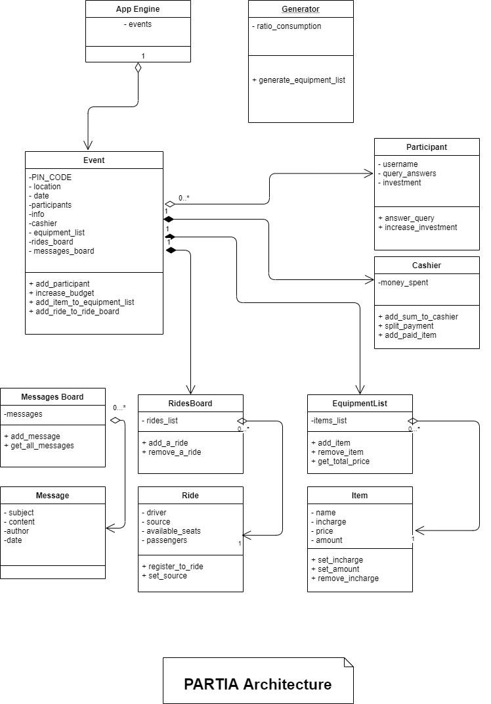

#PARTIA

**app_engine** - responsible for all events.

**partia_app** - responsible for all api requests.

**participant** - responsible for users logic and data.

**rides** - manage a rides board.

**chat** - manage a group messages board.

**cashier** - manage the expenses and budget.

**equipment** - manages the equipment list.

**event** - manage event data and logic. 
        Contains list of participants, a Cashier, Equipment list, Messages board, Rides board.  

**generator** - computes the equipment list.

[Postman requests](https://www.getpostman.com/collections/86f174641b826a5f5406)

#Architecture

